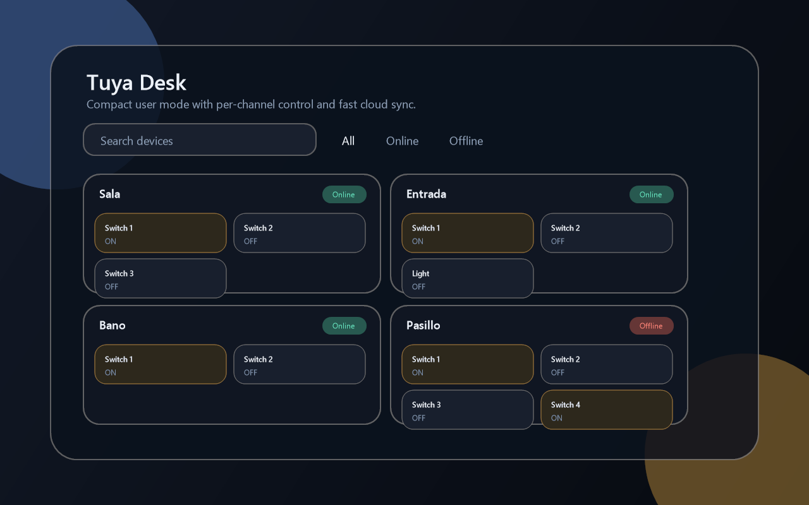
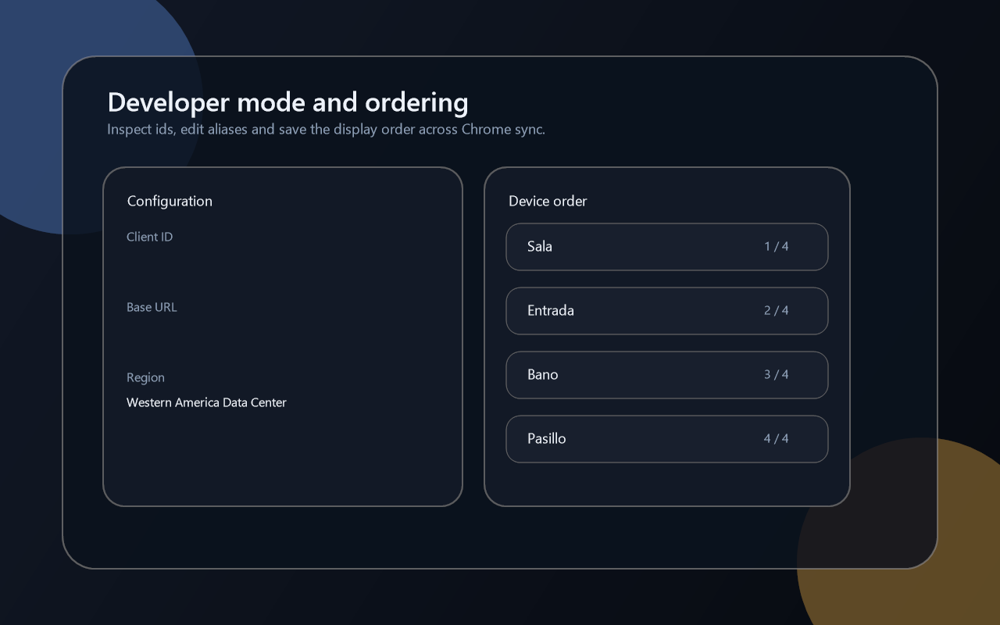

# Tuya Desk Chrome Extension

[](https://github.com/dorlanpabon/tuya_chrome_extension/releases)
[](https://github.com/dorlanpabon/tuya_chrome_extension/blob/main/LICENSE)
[](https://developer.chrome.com/docs/extensions)
[](https://www.typescriptlang.org/)

Compact Chrome extension for controlling Tuya and Tuya Smart wall switches by channel.

This project is the browser companion to the desktop app. It focuses on a fast popup UX, synced setup across Chrome profiles, and explicit channel control for multi-gang switches.

## Highlights

- Official Tuya Cloud integration
- Compact popup for everyday switch control
- Explicit support for `switch`, `switch_led`, and `switch_1` to `switch_4`
- Separate `User` and `Developer` modes
- Local aliases, device ordering, and compact UI preferences
- Bilingual UI with `English` and `Spanish`
- Chrome Web Store-ready package, assets, and privacy policy

## Screenshots

User mode:



Developer mode:



## Why this extension exists

The main desktop app is useful when you want a dedicated controller window, but there are cases where a browser popup is a better fit:

- quick access without opening a full desktop window
- synced setup across Chrome on multiple machines
- compact control from a toolbar popup
- faster iteration for browser-centric workflows

## Features

- Save `TUYA_CLIENT_ID`
- Save `TUYA_CLIENT_SECRET`
- Save `TUYA_BASE_URL`
- Validate `TUYA_BASE_URL` against supported official Tuya OpenAPI hosts
- Store configuration in `chrome.storage.sync`
- Reuse synced setup across Chrome installations
- Test Tuya Cloud connectivity
- List linked devices
- Detect multi-gang channels automatically
- Toggle each channel independently
- Refresh real state without blocking the popup UI
- Save local device aliases and channel aliases
- Save manual device order

## Supported Tuya hosts

This build intentionally limits host access to official Tuya OpenAPI domains:

- `https://openapi.tuyaus.com`
- `https://openapi-ueaz.tuyaus.com`
- `https://openapi.tuyaeu.com`
- `https://openapi-weaz.tuyaeu.com`
- `https://openapi.tuyacn.com`
- `https://openapi.tuyain.com`

That keeps the extension aligned with Chrome Web Store review expectations and avoids broad host permissions.

## Getting Tuya credentials

Recommended steps in Tuya Developer Platform:

1. Open [Tuya Developer Platform](https://platform.tuya.com/).
2. Create or open your cloud project in `Cloud > Development`.
3. Open the `Overview` tab.
4. Copy `Access ID` and `Access Secret` from `Cloud Application Authorization Key`.
5. Link your Tuya Smart or Smart Life app to the cloud project if the devices are not showing up yet.

Official references:

- [Cloud development overview](https://developer.tuya.com/en/docs/cloud)
- [How to get Access ID / Access Secret](https://developer.tuya.com/en/docs/iot/device-control-best-practice-nodejs?_source=751e806efb9d0a8cb3793945cccdc47e&id=Kaunfr776vomb)
- [Link devices to your cloud project](https://developer.tuya.com/en/docs/iot/link-devices?_source=0d3f09cd9c61de21759f60ac3a058d51&id=Ka471nu1sfmkl)

Typical values:

- `Client ID`: your Tuya `Access ID`
- `Client Secret`: your Tuya `Access Secret`
- `Base URL`: for example `https://openapi.tuyaus.com`
- `Region`: for example `Western America Data Center`

## Stack

- `Chrome Extension Manifest V3`
- `Vite`
- `Preact`
- `TypeScript`
- background service worker for Tuya Cloud communication

## Local development

```bash
npm install
npm run build
```

Build the Chrome Web Store package:

```bash
npm run package:webstore
```

## Load in Chrome

1. Run `npm run build`
2. Open `chrome://extensions`
3. Enable `Developer mode`
4. Click `Load unpacked`
5. Select the `dist` folder

## Project structure

```text
src/
  background/
  popup/
  shared/
  styles/

public/
  _locales/
  icons/

docs/
  chrome-web-store.md
  chrome-web-store-submission-es.md
  privacy-policy.md
```

## Architecture

- `src/background`
  - Tuya client
  - HMAC-SHA256 signing
  - `chrome.storage.sync` and `chrome.storage.local`
  - runtime message handlers
- `src/popup`
  - compact popup UI
  - `User` mode
  - `Developer` mode
- `src/shared`
  - domain models
  - filters
  - formatting
  - i18n

## Security and storage

- `chrome.storage.sync`
  - Tuya credentials
  - aliases
  - UI preferences
  - device order
- `chrome.storage.local`
  - cached device state
  - action log

The current MVP stores the Tuya secret in Chrome sync storage for portability. A sensible hardening path would be encrypting the secret locally before syncing it.

## Chrome Web Store materials

- Listing docs: [docs/chrome-web-store.md](/D:/xampp/htdocs/tuya_chrome_extension/docs/chrome-web-store.md)
- Submission helper in Spanish: [docs/chrome-web-store-submission-es.md](/D:/xampp/htdocs/tuya_chrome_extension/docs/chrome-web-store-submission-es.md)
- Privacy policy source: [docs/privacy-policy.md](/D:/xampp/htdocs/tuya_chrome_extension/docs/privacy-policy.md)
- Published privacy policy: [dorlanpabon.github.io/tuya_chrome_extension/privacy-policy.html](https://dorlanpabon.github.io/tuya_chrome_extension/privacy-policy.html)
- Upload package: [webstore-package.zip](/D:/xampp/htdocs/tuya_chrome_extension/webstore-package.zip)

## Status

This is a functional MV3 extension aimed at real Tuya switch control. It is not a boilerplate extension repo.
